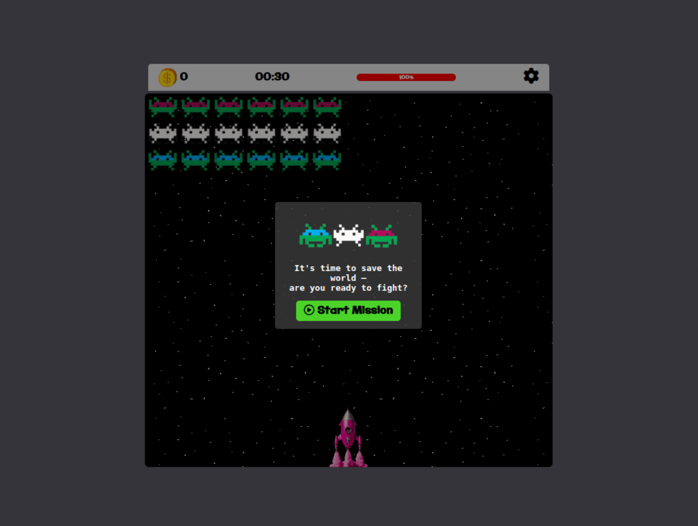

# Space Invaders

Recreation of the original 1978 Space Invaders arcade game.
Built with HTML, CSS and vanilla JavaScript.

[▶ Play Now](https://emanzhd.github.io/spaceInvaders/)  |  [</> Source Code](https://github.com/EmanZHD/spaceInvaders)



---

### 🎮 **How to Play**  
- **Defeat all aliens** before they reach the bottom.  
- **Score points** by shooting invaders.  
- **Lives**: Lose all lives, and the game ends.  

### 🕹️ **Controls**  
| Action    | Key(s)                     |  
|-----------|----------------------------|  
| Move      | <kbd>←</kbd> <kbd>→</kbd>  |  
| Shoot     | <kbd>Space</kbd>           |  
| Pause     | <kbd>P</kbd> or <kbd>Esc</kbd> |  

---

### 🚀 **Run Locally**  
```bash  
git clone https://github.com/EmanZHD/spaceInvaders.git  
cd space-invaders  
open index.html  